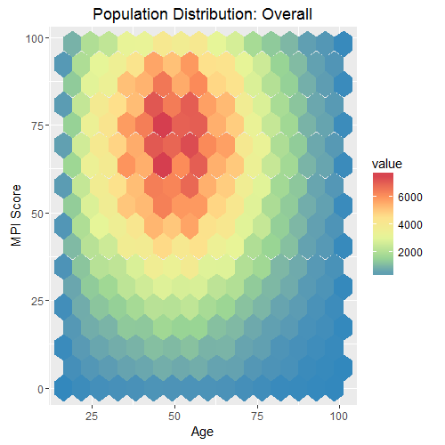
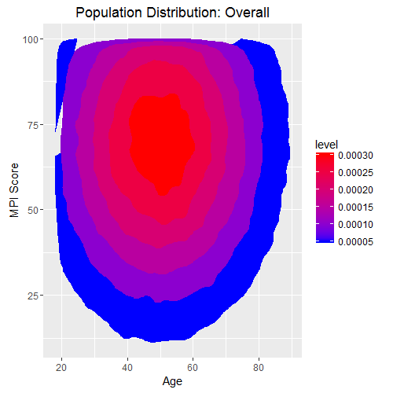

Load packages:
```R
library(ggplot2)
library(truncnorm)
```
Truncnorm is used for generating truncated distributions of numbers.

Generate random numbers and put in dataframe:
```R
age <- round(rtruncnorm(679655, a = 18, b = 100, mean = 50, sd = 20))
score <- round(rtruncnorm(679655, a = 0, b = 100, mean = 70, sd = 30))

df <- data.frame(age, score)
```
Tried out a hex plot. Bins are adjustable.
```R
#Hex Plot
ggplot(df, aes(y = score, x = age)) + 
  stat_binhex(bins = 15) +
  scale_fill_distiller(palette = "Spectral") +
  labs(x = "Age", y = "MPI Score") +
  ggtitle("Population Distribution: Overall")
```


And tried out one with a gradient:
```R
#Gradient Plot
ggplot(df,aes(y = score, x = age))+
  stat_density2d(aes(fill=..level..), geom="polygon") +
  scale_fill_gradient(low="blue", high="red") +
  labs(x = "Age", y = "MPI Score") +
  ggtitle("Population Distribution: Overall")
 ```
 
